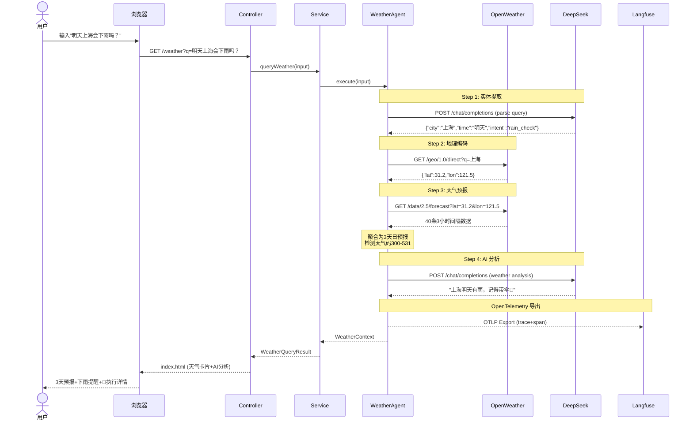

# Embabel Weather 开发纪实：用 Java + AI Agent 构建智能天气预报

> **项目地址**: [github.com/quarktimes/embabel-weather](https://github.com/quarktimes/embabel-weather)
>
> **技术栈**: Java 21 · Spring Boot 3.5.9 · Embabel 0.3.5 · DeepSeek V4 · OpenWeather API

---

## 一、缘起

最近在探索 Java 生态下的 AI Agent 框架，发现了 Rod Johnson（Spring 框架创始人）的新项目 **Embabel**——一个基于 JVM 的 AI Agent 框架，支持 GOAP（目标导向行动规划），深度集成 Spring Boot。

想做一个有实际价值的 demo，最后选定了天气预报场景：

**用户输入自然语言** → **Agent 自动规划执行路径** → **调 OpenWeather API 拿数据** → **DeepSeek 生成分析** → **页面展示**

核心需求很简单：输入"明天上海会下雨吗？"，系统自动识别城市、查天气、分析趋势、提醒带伞。

---

## 二、项目搭建

### 2.1 基础选型

| 组件 | 版本 | 用途 |
|------|------|------|
| Java | 21 | Record、Pattern Matching |
| Maven | 3.9+ | 构建管理 |
| Spring Boot | 3.5.9 | Web 框架 |
| Embabel | 0.3.5 | AI Agent 编排 |
| DeepSeek | V4 | 自然语言处理 |
| OpenWeather | Free API | 天气数据源 |
| Thymeleaf | 6.x | 服务端渲染 |
| Caffeine | 3.x | 本地缓存 |

### 2.2 项目结构

```
embabel-weather/
├── config/         配置类（Caffeine 缓存、OpenWeather 配置）
├── model/          领域 Record（GeoLocation、DayForecast、ParsedQuery）
├── client/         OpenWeather API 客户端 + DTO
├── agent/          WeatherAgent + 审计服务
├── service/        业务编排 + 缓存 + 降级
└── controller/     Web 路由
```

所有的 DTO 使用 Java 21 Record，不可变、简洁、天然携带 equals/hashCode。

---

## 三、遇到的坑与解决方案

### 🕳️ 坑一：Embabel 启动失败 — LLM 模型未注册

**现象：**

```
Default LLM 'gpt-4.1-mini' not found in available models: []
```

应用启动直接崩溃，Agent 平台初始化失败。

**原因分析：**

Embabel 0.3.5 启动时会自动初始化 `AgentPlatform`，它依赖 Spring AI 的 `ChatClient` 来发现可用的 LLM 模型。由于我们没有配置任何 LLM 提供者，模型列表为空，但 Embabel 默认要求 `gpt-4.1-mini` 作为默认模型，这一验证在启动时强制执行。

当时的依赖是：

```xml
<!-- ❌ 初始的错误配置 -->
<dependency>
    <groupId>com.embabel.agent</groupId>
    <artifactId>embabel-agent-starter</artifactId>
</dependency>
<dependency>
    <groupId>com.embabel.agent</groupId>
    <artifactId>embabel-agent-openai</artifactId>
</dependency>
```

`embabel-agent-starter` 是通用启动器，`embabel-agent-openai` 只是一个 OpenAI 模型工厂，**不包含 LLM 提供者的自动注册**。所以 Agent 平台找不到任何可用的模型。

**第一次修复尝试（失败）：**

想通过添加 Spring AI 的 OpenAI Starter 来解决：

```xml
<dependency>
    <groupId>org.springframework.ai</groupId>
    <artifactId>spring-ai-openai-spring-boot-starter</artifactId>
    <version>1.0.0-M6</version>
</dependency>
```

结果 Spring AI 1.0.0-M6 与 Embabel 0.3.5 **内嵌的 Spring AI 1.1.4 版本冲突**，出现了 Bean 重复定义错误。

**第二次修复（临时绕过）：**

手动排除了 Embabel 的自动配置，用 RestClient 直接调用 DeepSeek API：

```yaml
spring:
  autoconfigure:
    exclude:
      - com.embabel.agent.autoconfigure.platform.AgentPlatformAutoConfiguration
```

同时在 WeatherAgent 中放弃注入 `Ai` 接口，改为用 RestClient 手拼 JSON 调 DeepSeek：

```java
// ❌ 临时方案：手写 HTTP 调用
String response = restClient.post()
    .uri("https://api.deepseek.com/chat/completions")
    .header("Authorization", "Bearer " + apiKey)
    .body(new DeepSeekRequest(...))
    .retrieve()
    .body(DeepSeekResponse.class);
```

虽然能跑，但代价很大：
- 失去了 Embabel 的 LLM 抽象层
- 无法享受 Agent 观测能力
- 换模型得改代码
- 代码丑陋

**最终解决方案：**

发现了 `embabel-agent-starter-deepseek` 这个专为 DeepSeek 设计的启动器：

```xml
<dependency>
    <groupId>com.embabel.agent</groupId>
    <artifactId>embabel-agent-starter-deepseek</artifactId>
    <version>0.3.5</version>
</dependency>
```

它会自动注册 `deepseek-chat` 和 `deepseek-reasoner` 两个模型到 Embabel 的 ModelProvider 中，同时解决两个问题：
1. ✅ LLM 模型自动注册
2. ✅ 无需手动配置 Spring AI 版本

然后配置默认模型：

```yaml
embabel:
  models:
    default-llm: deepseek-chat
```

最后回到干净的 `Ai` 注入：

```java
@Autowired
private Ai ai;

String result = ai.withDefaultLlm().generateText(prompt);
```

---

### 🕳️ 坑二：Lombok 注解不生效

**现象：**

编译时报错 `getUnits()`、`getApiKey()` 等方法找不到。

**原因：**

Maven 编译时缺少 Lombok 的 annotation processor 配置。

**解决：**

```xml
<plugin>
    <groupId>org.apache.maven.plugins</groupId>
    <artifactId>maven-compiler-plugin</artifactId>
    <configuration>
        <source>21</source>
        <target>21</target>
        <annotationProcessorPaths>
            <path>
                <groupId>org.projectlombok</groupId>
                <artifactId>lombok</artifactId>
            </path>
        </annotationProcessorPaths>
    </configuration>
</plugin>
```

---

### 🕳️ 坑三：Spring ASI 版本冲突

**现象：**

```
The bean 'chatClientBuilderConfigurer' could not be registered. 
A bean with that name has already been defined.
```

**原因：**

Embabel 0.3.5 内嵌了 Spring AI 1.1.4，而我添加的 `spring-ai-openai-spring-boot-starter:1.0.0-M6` 也包含了相同的自动配置类，导致 Bean 冲突。

**解决：**

移除手动添加的 Spring AI 依赖，改用 `embabel-agent-starter-deepseek`，它自动管理版本兼容性。

---

### 🕳️ 坑四：OpenWeather 城市名显示为英文

**现象：**

设置 `lang=zh_cn` 后，返回的城市名仍然是 "Beijing" 而非 "北京"。

**原因：**

OpenWeather 免费版的 Geocoding API 返回的城市名基于匹配到的结果，中文查询返回的 `name` 字段是英文名。这不是配置问题，是免费 API 的限制。

**影响：**

不影响功能，只是 UI 上城市名显示为英文。

---

## 四：Observability — 让 Agent 可观测

### 4.1 为什么需要可观测性

Agent 应用与传统 Web 应用最大的区别在于：**执行路径不确定**。传统 API 是"请求 → 处理 → 响应"的线性路径，而 Agent 会根据输入动态规划行动序列，每条路径都可能不同。

没有可观测性，你就不知道：
- Agent 当前执行到哪一步了
- 哪一步最耗时
- LLM 调用返回了什么
- 如果出错了，是在哪一步出的

### 4.2 两层次的可观测

#### 用户层：页面透明 Agent

在页面底部展示 Agent 的执行链路，让用户看到系统在做什么：

```
🔍 执行详情
  ✅ ① 解析查询 → 上海 / 明天 / rain_check  [0.8s]
  ✅ ② 地理编码 → Shanghai (31.2, 121.5)     [0.4s]
  ✅ ③ 获取预报 → 3 天数据                    [0.5s]
  ✅ ④ AI 分析 → DeepSeek 生成完成            [1.7s]
```

实现方式：`AgentAuditRecord` + `AgentAuditService`，在内存中保留最近 100 条记录。

#### 开发者层：OpenTelemetry → Langfuse

利用 Embabel 的观测模块 + 社区 Langfuse 导出器，实现全链路追踪：

```xml
<!-- 依赖 -->
<dependency>
    <groupId>com.embabel.agent</groupId>
    <artifactId>embabel-agent-starter-observability</artifactId>
</dependency>
<dependency>
    <groupId>com.quantpulsar</groupId>
    <artifactId>opentelemetry-exporter-langfuse</artifactId>
    <version>0.4.0</version>
</dependency>
```

配置：

```yaml
embabel:
  observability:
    enabled: true
    trace-llm-calls: true
    trace-agent-events: true
    trace-http-details: true

management:
  langfuse:
    public-key: ${LANGFUSE_PUBLIC_KEY}
    secret-key: ${LANGFUSE_SECRET_KEY}
    endpoint: https://us.cloud.langfuse.com/api/public/otel
```

启动后在 Langfuse 面板可以看到：
- Agent 执行全链路（trace → span）
- 每次 DeepSeek 调用的 prompt 和 response
- 各步骤耗时瀑布图
- Token 消耗统计

---

## 五：架构演进时间线

```
v1 — 脚手架搭建
  ├── Spring Boot 3.5.9 + Java 21
  ├── 基础项目结构
  └── 可编译验证

v2 — 数据层打通
  ├── OpenWeather REST 客户端
  ├── 聚合 3小时间隔 → 3天日预报
  ├── 下雨检测规则引擎
  └── Caffeine 缓存

v3 — 错误路线与回退
  ├── 用 embabel-agent-starter + embabel-agent-openai ❌
  ├── AgentPlatform 初始化失败
  ├── 添加 Spring AI 引发版本冲突 ❌
  └── 排除自动配置，手写 DeepSeek HTTP 调用（临时方案）

v4 — 正确路线
  ├── embabel-agent-starter → embabel-agent-starter-deepseek ✅
  ├── 回到 Ai 接口注入
  ├── 页面透明 Agent 审计
  └── 回归 Ai 接口，代码减少 60%

v5 — 可观测性
  ├── embabel-agent-starter-observability
  ├── opentelemetry-exporter-langfuse
  ├── OpenTelemetry tracing + Micrometer metrics
  └── Langfuse 面板可见
```

---

## 六：最终架构总览

```
用户输入 "明天上海会下雨吗？"
       │
       ▼
  ┌──────────────────┐
  │  Thymeleaf 页面  │  ← index.html + style.css
  └──────┬───────────┘
         │
  ┌──────▼───────────┐
  │  WeatherController│  GET /weather?q=...
  └──────┬───────────┘
         │
  ┌──────▼───────────┐
  │  WeatherService  │  缓存 + 降级编排
  └──────┬───────────┘
         │
  ┌──────▼───────────┐
  │  WeatherAgent    │  ← 通过 Ai 接口调 DeepSeek
  │                   │
  │  parseQuery  ──────→ DeepSeek 提取城市/时间/意图
  │  geocode    ──────→ OpenWeather Geo API
  │  forecast   ──────→ OpenWeather Forecast API
  │  analyze    ──────→ DeepSeek 天气分析
  │                   │
  │  AgentAuditService│  每一步记录审计轨迹
  └──────┬───────────┘
         │
         ▼
  ┌──────────────────┐
  │  Langfuse 面板   │  ← OpenTelemetry trace
  └──────────────────┘
```

---

## 七：LLM 调用策略 — 只用在最关键的地方

整个流程 **只调用 DeepSeek 两次**，且都有降级保障：

| 步骤 | LLM 调用 | 触发条件 | 降级策略 |
|------|----------|----------|----------|
| ① 实体提取 | ✅ parseQuery | 输入包含问句/非纯城市名 | 降级为整段输入当城市名 |
| ② 天气分析 | ✅ analyze | 成功获取预报数据 | 规则生成"未来3天有雨带伞" |
| ③ 地理编码 | ❌ | — | — |
| ④ 天气预报 | ❌ | — | — |

**优化细节**：`parseQuery` 内有一个 `isPlainCityName()` 快速判断——如果输入是"北京""上海"这类纯中文城市名，直接返回，**零 LLM 调用**。只有"明天上海会下雨吗？"这种自然语言问句才调用 DeepSeek。

---

## 八：核心调用时序图

以下是一次完整查询的调用时序（适用于公众号文章，建议截图或配合 Mermaid 渲染工具生成图片）：

```
用户                         浏览器              Controller           Service           WeatherAgent         OpenWeather        DeepSeek         Langfuse
 │                           │                   │                   │                  │                   │                  │              │
 │  输入"明天上海会下雨吗？"   │                   │                   │                  │                   │                  │              │
 │──────────────────────────→│                   │                   │                  │                   │                  │              │
 │                           │                   │                   │                  │                   │                  │              │
 │                           │  GET /weather?q=  │                   │                  │                   │                  │              │
 │                           │──────────────────→│                   │                  │                   │                  │              │
 │                           │                   │                   │                  │                   │                  │              │
 │                           │                   │  queryWeather()   │                  │                   │                  │              │
 │                           │                   │──────────────────→│                  │                   │                  │              │
 │                           │                   │                   │                  │                   │                  │              │
 │                           │                   │                   │  execute(input)  │                   │                  │              │
 │                           │                   │                   │─────────────────→│                   │                  │              │
 │                           │                   │                   │                  │                   │                  │              │
 │                           │                   │                   │    startTrace()  │                   │                  │              │
 │                           │                   │                   │─────────────────→│  AgentAuditService │                  │              │
 │                           │                   │                   │←────────────────│  返回 traceId     │                  │              │
 │                           │                   │                   │                  │                   │                  │              │
 │   ── Step 1: 实体提取 ──  │                   │                   │                  │                   │                  │              │
 │                           │                   │                   │  parseQuery()    │                   │                  │              │
 │                           │                   │                   │─────────────────→│                   │                  │              │
 │                           │                   │                   │                  │   POST /chat/completions            │              │
 │                           │                   │                   │                  │──────────────────────────────────→│              │
 │                           │                   │                   │                  │                   │                  │              │
 │                           │                   │                   │                  │   ←  {"city":"上海",...}           │              │
 │                           │                   │                   │                  │←──────────────────────────────────│              │
 │                           │                   │                   │                  │                   │                  │              │
 │                           │                   │                   │   record(✅ parseQuery 797ms)                         │              │
 │                           │                   │                   │─────────────────→│  AgentAuditService │                  │              │
 │                           │                   │                   │                  │                   │                  │              │
 │   ── Step 2: 地理编码 ──  │                   │                   │                  │                   │                  │              │
 │                           │                   │                   │  geocode("上海") │                   │                  │              │
 │                           │                   │                   │─────────────────→│                   │                  │              │
 │                           │                   │                   │                  │  GET /geo/1.0/direct              │              │
 │                           │                   │                   │                  │─────────────────→│                  │              │
 │                           │                   │                   │                  │                   │                  │              │
 │                           │                   │                   │                  │  ← {"lat":31.2,"lon":121.5}      │              │
 │                           │                   │                   │                  │←─────────────────│                  │              │
 │                           │                   │                   │   record(✅ geocode 415ms)                         │              │
 │                           │                   │                   │─────────────────→│  AgentAuditService │                  │              │
 │                           │                   │                   │                  │                   │                  │              │
 │   ── Step 3: 天气预报 ──  │                   │                   │                  │                   │                  │              │
 │                           │                   │                   │  forecast(31.2, 121.5) │                │                  │              │
 │                           │                   │                   │─────────────────→│                   │                  │              │
 │                           │                   │                   │                  │  GET /data/2.5/forecast           │              │
 │                           │                   │                   │                  │─────────────────→│                  │              │
 │                           │                   │                   │                  │                   │                  │              │
 │                           │                   │                   │                  │  ← 40条3小时数据                 │              │
 │                           │                   │                   │                  │←─────────────────│                  │              │
 │                           │                   │                   │                  │                   │                  │              │
 │                           │                   │                   │                  │  聚合为3天日预报                  │              │
 │                           │                   │                   │                  │  检测天气码300-531               │              │
 │                           │                   │                   │                  │                   │                  │              │
 │                           │                   │                   │   record(✅ forecast 508ms)                        │              │
 │                           │                   │                   │─────────────────→│  AgentAuditService │                  │              │
 │                           │                   │                   │                  │                   │                  │              │
 │   ── Step 4: AI 分析 ──  │                   │                   │                  │                   │                  │              │
 │                           │                   │                   │  analyze(预报数据)│                   │                  │              │
 │                           │                   │                   │─────────────────→│                   │                  │              │
 │                           │                   │                   │                  │   POST /chat/completions            │              │
 │                           │                   │                   │                  │──────────────────────────────────→│              │
 │                           │                   │                   │                  │                   │                  │              │
 │                           │                   │                   │                  │   ← 分析结果                     │              │
 │                           │                   │                   │                  │←──────────────────────────────────│              │
 │                           │                   │                   │                  │                   │                  │              │
 │                           │                   │                   │   record(✅ analyze 1381ms)                        │              │
 │                           │                   │                   │─────────────────→│  AgentAuditService │                  │              │
 │                           │                   │                   │                  │                   │                  │              │
 │   ── OpenTelemetry 导出 ──│                   │                   │                  │                   │                  │              │
 │                           │                   │                   │                  │                   │                  │              │
 │                           │                   │                   │                  │                   │  OTLP Export     │              │
 │                           │                   │                   │                  │                   │─────────────────→│              │
 │                           │                   │                   │                  │                   │                  │              │
 │   ── 页面渲染 ──          │                   │                   │                  │                   │                  │              │
 │                           │                   │  ← WeatherQueryResult              │                   │                  │              │
 │                           │                   │←──────────────────│                  │                   │                  │              │
 │                           │                   │                   │                  │                   │                  │              │
 │                           │  ← index.html     │                   │                  │                   │                  │              │
 │                           │←─────────────────│                   │                  │                   │                  │              │
 │                           │                   │                   │                  │                   │                  │              │
 │   ← 3天天气卡片+AI分析    │                   │                   │                  │                   │                  │              │
 │←──────────────────────────│                   │                   │                  │                   │                  │              │
 │                           │                   │                   │                  │                   │                  │              │
```

> 💡 本时序图建议配合 [Mermaid Live Editor](https://mermaid.live/) 渲染为图片后插入公众号文章。

对应的 Mermaid 源码（可复制到 https://mermaid.live/ 生成图片）：



---

## 九、关键技术决策

| 决策点 | 选择 | 理由 |
|--------|------|------|
| LLM 集成为式 | Embabel Ai 接口 | 统一抽象，换模型不改代码 |
| 下雨检测 | 规则引擎 + AI 增强 | 规则 100% 不漏报，AI 负责自然描述 |
| 异常降级 | 静默降级 | LLM 挂了 → 跳过 AI 分析，数据卡片照常 |
| 缓存 | Caffeine 本地 | MVP 无外部依赖，10 分钟过期 |
| 前端 | Thymeleaf 服务端渲染 | 无需前后端分离，最快交付 |
| 可观测 | OpenTelemetry + Langfuse | 业界标准，生态成熟 |

---

## 十、项目地址

如果你对本文的技术方案感兴趣，欢迎 Star 和 Fork：

**[github.com/quarktimes/embabel-weather](https://github.com/quarktimes/embabel-weather)**

本地运行：

```bash
export DEEPSEEK_API_KEY=sk-xxx
export OPENWEATHER_API_KEY=xxx
mvn spring-boot:run
```

打开浏览器访问 `http://localhost:8080`，输入"明天上海会下雨吗？"试试。

---

*本文由 Claude Code 辅助撰写，项目代码在开发过程中与 AI 结对编程完成。*
